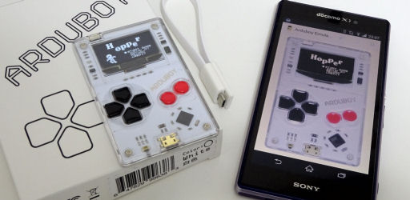

# Arduboy Emulator
This is an Android application to emulate Arduboy. \
https://play.google.com/store/apps/details?id=com.obnsoft.arduboyemu \

## Functions
 - Play with virtual pad.
 - LED emulation.
 - Speed control.
 - Backup and restore EEPROM data.

## Restrictions
 - Audio is unsupported.
 - Some programmes don't work correctly. It may possibly freeze.
   - Disabling audio may be effective to avoid freeze.

## Acknowledgement

### Libraries
 - [simavr](https://github.com/buserror/simavr)
 - [Red Hat elfutils](https://android.googlesource.com/platform/external/elfutils)

### Image resources
 - Pixelart of Arduboy device by [Piquesel (@huard_olivier)](https://twitter.com/huard_olivier).
 - Some icons are generated by [無料素材サービス](https://sozai.cman.jp/).

## License
GNU General Public License, Version 3.0
